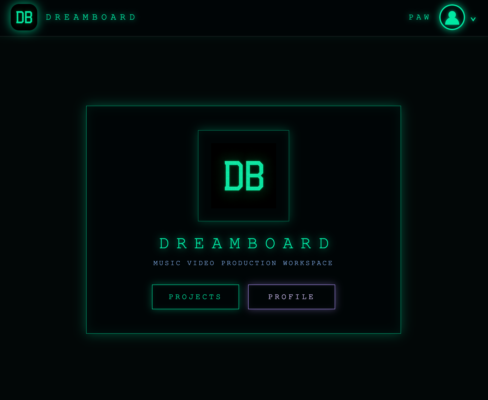
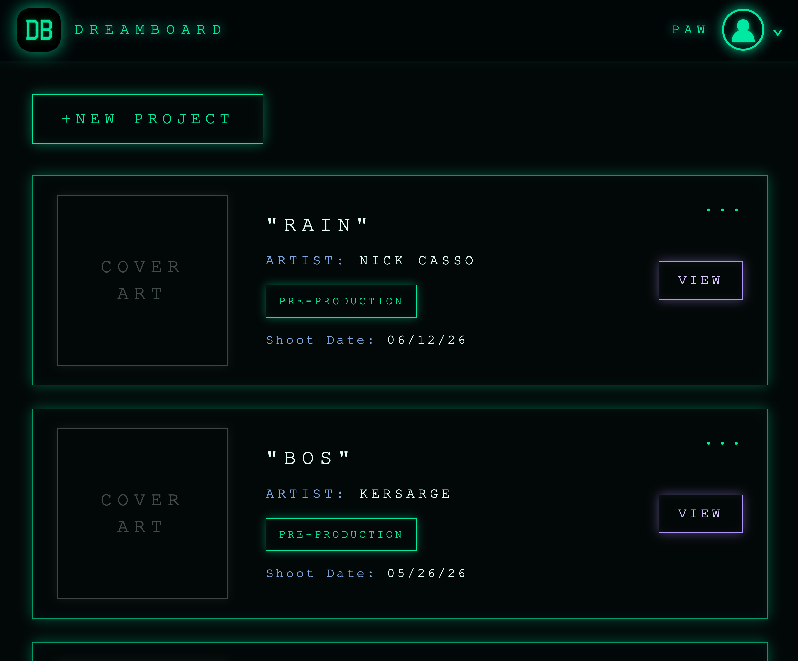
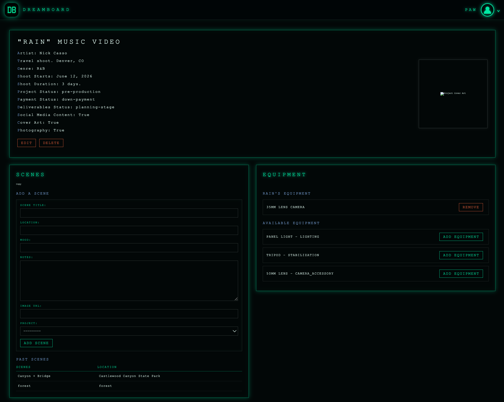
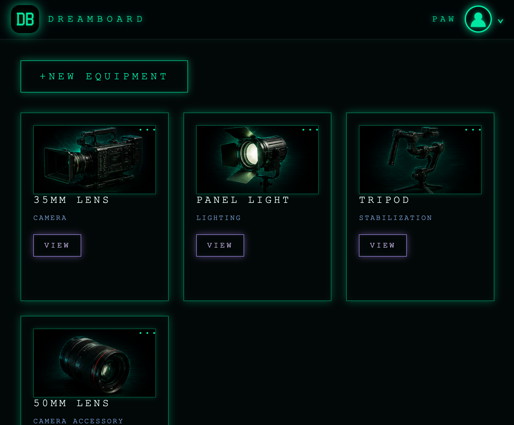
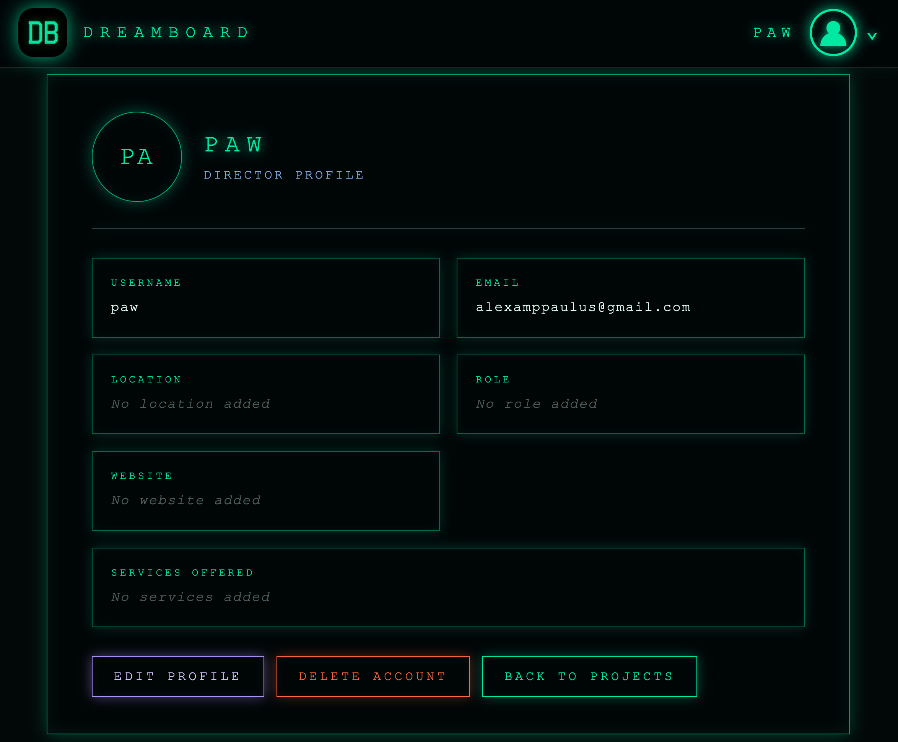

# DREAMBOARD MV Planner

## Getting Started

### Deployed Application

_Add deployed Render link here_

### GitHub Repository

_Add GitHub repository link here_

## Description

DREAMBOARD MV Planner is a full-stack Django web application built for music video directors and creative production teams to organize projects, scenes, equipment, and production details in one centralized workspace.

The app was designed around the real workflow of planning music video shoots: tracking artist/song information, production status, payment status, deliverables, scene ideas, and equipment needs. Instead of managing scattered notes, gear lists, and shoot details across multiple apps, DREAMBOARD gives directors a focused production dashboard for each project.

## How to Use

1. Create an account or log in.
2. Add a new music video project.
3. Track project details such as artist name, song title, shoot date, project status, payment status, and deliverables.
4. Add scenes to the project detail page.
5. Add equipment to your personal equipment library.
6. Assign equipment to specific projects.
7. View and update your profile information.

## Features

- User authentication with sign up, log in, and log out functionality
- Authorization-protected pages using Django authentication
- User-specific project ownership
- User-specific equipment ownership
- Full CRUD functionality for music video projects
- Full CRUD functionality for equipment
- Scene creation connected to individual projects
- Many-to-many relationship between projects and equipment
- Add and remove equipment from specific projects
- Profile page for director/studio information
- Custom styled responsive UI inspired by cinematic production dashboards
- PostgreSQL database integration
- Django Admin integration
- Dynamic templates using Django Template Language

## App Screenshots

### Home Page

### Project Index Page

### Project Detail Page

### Equipment Index Page

### Profile Page

## Technologies Used

- Python
- Django
- PostgreSQL
- HTML
- CSS
- Django Templates
- Django Authentication
- Git
- GitHub
- Render

### Planning Materials

[Trello Board](https://trello.com/b/WwcG38jw/music-video-plannerdreamboard)
- Wireframes: included in trello board
- ERD: included in trello board

## Entity Relationship Overview

The application includes the following main models:

- User
- Profile
- Project
- Scene
- Equipment

Relationships:

- A User has one Profile.
- A User has many Projects.
- A User has many Equipment items.
- A Project has many Scenes.
- A Project can have many Equipment items.
- Equipment can belong to many Projects.

## Authorization

DREAMBOARD uses Django authentication and authorization to protect user data.

- Logged-out users cannot access project, equipment, or profile pages.
- Logged-in users only see their own projects.
- Logged-in users only see their own equipment.
- Project and equipment creation automatically assigns ownership to the logged-in user.

## Future Improvements

- Allow users to upload custom cover art for each project
- Add image uploads for equipment items
- Add moodboard/reference image uploads
- Add calendar integration for shoot scheduling
- Add budget tracking for production costs
- Add team collaboration features
- Add shot list generation
- Add production checklist templates
- Add custom project tags and filters
- Improve mobile layout and touch interactions

## Author

Alex Paulus